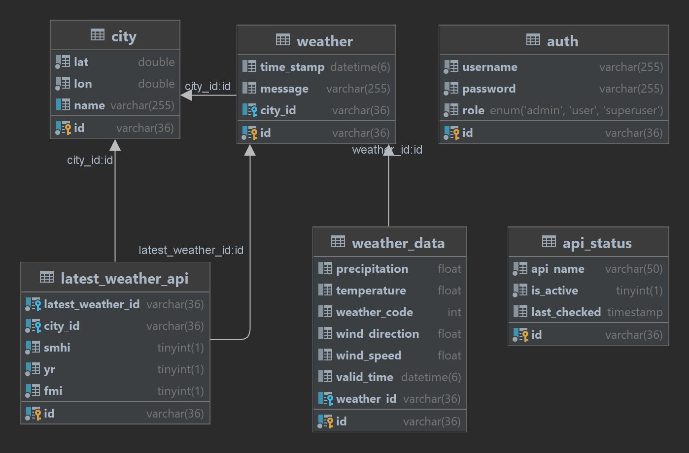

# Database for [WeatherApi project](https://github.com/knottem/WeatherApi)

## Description

This is a database for the [WeatherApi project](https://github.com/knottem/WeatherApi) that is written by using Dockerfile and sql scripts. The database is a MySQL database and it is used to store city information(Name, Longitute and Latitute) and also a user table for the users of the WeatherApi.

## Database Structure Overview

The tables for the database include `city`, `user`, `weather`, and `weather_data`. Below is a detailed overview of each table and their respective columns:

### Tables and Columns

#### 1. City Table

This table stores information about cities.

- **id**: Unique identifier for the city.
- **name**: Name of the city.
- **lon**: Longitude coordinate of the city.
- **lat**: Latitude coordinate of the city.

#### 2. User Table

This table keeps track of user information.

- **id**: Unique identifier for the user.
- **username**: The user's chosen username.
- **password**: The user's password (hashed for security).
- **role**: Defines the user's role within the system. Roles can be one of the following: `USER`, `SUPERUSER`, or `ADMIN`.

#### 3. Weather Table

Contains weather information linked to cities.

- **id**: Unique identifier for the weather record.
- **timestamp**: The timestamp indicating when the weather data was recorded.
- **message**: A message or key associated with the weather, used by the backend.
- **city**: The ID of the city this weather record is associated with.

#### 4. Weather Data Table

Holds detailed weather data.

- **id**: Unique identifier for the weather data entry.
- **precipitation**: The amount of precipitation.
- **temperature**: The recorded temperature.
- **weather_code**: A code representing the type of weather.
- **wind_direction**: The direction from which the wind is coming.
- **wind_speed**: The speed of the wind.
- **valid_time**: The time period for which the weather data is considered valid.
- **weather_id**: Links this weather data to a specific weather record.

#### 5. Latest Weather Table

Stores keys for the latest weather data for each city

- **id**: Unique identifier for the latest weather record.
- **latest_weather_id**: The ID of the weather record associated with this latest weather data.
- **city_id**: The ID of the city this weather record is associated with.
- **smhi**: Boolean value indicating if the weather contains data from SMHI.
- **yr**: Boolean value indicating if the weather contains data from YR.
- **fmi**: Boolean value indicating if the weather contains data from FMI.

#### 6. API Status Table

Stores information if an API is enabled or disabled.

- **id**: Unique identifier for the API status record.
- **api_name**: The name of the API.
- **is_active**: Boolean value indicating if the API is enabled or disabled.
- **last_checked**: The timestamp of the last update to the API status.

### Database schema is shown in the image below:

## Made by

- [Erik](https://github.com/knottem)
